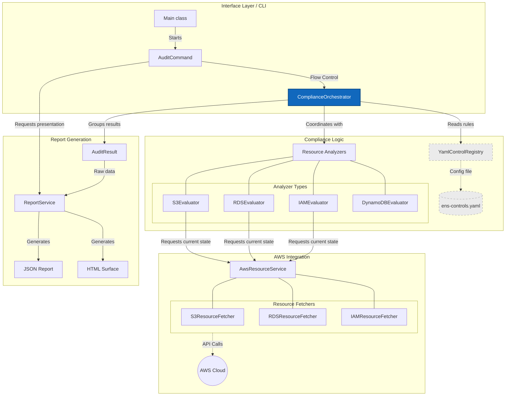

# ENS Auditor

Command-line tool to evaluate AWS infrastructure compliance with the Spanish National Security Scheme (ENS) and CCN-STIC 887.

[Documentation](https://juanmorschrott.github.io/ens-auditor/) 

[GitHub Releases](https://github.com/juanmorschrott/ens-auditor/releases)

## Requirements

- Java 25+ (or GraalVM 25+ for native image)
- Maven 3.9+
- AWS credentials configured via the standard SDK chain

## Quick start

```bash
./mvnw -Pnative package -DskipTests

# e.g.
./target/ens-auditor audit --output table
./target/ens-auditor --help
```

## Downloads

Pre-built native binaries are available on [GitHub Releases](https://github.com/juanmorschrott/ens-auditor/releases):

| Platform              | Binary                          |
|-----------------------|---------------------------------|
| Linux (amd64)         | `ens-auditor-linux-amd64`       |
| Linux (arm64)         | `ens-auditor-linux-arm64`       |
| Windows (amd64)       | `ens-auditor-windows-amd64.exe` |

## Available commands

| Command               | Description                                 |
|-----------------------|---------------------------------------------|
| `audit`               | Run compliance audit on AWS infrastructure  |
| `list-controls`       | List available ENS controls                 |
| `status`              | Show audit status and compliance summary    |
| `generate-completion` | Generate shell completion script (bash/zsh) |

### Options for `audit`

| Option                     | Description                                                       |
|----------------------------|-------------------------------------------------------------------|
| `-o, --output <format>`    | Output format: `json`, `table`, `html`, `csv` (default: `table`) |
| `-c, --control <id>`       | Evaluate a specific control ID only                               |
| `-s, --severity <level>`   | Filter by minimum severity: `CRITICAL`, `HIGH`, `MEDIUM`, `LOW`  |
| `-f, --output-file <path>` | Write report to file instead of stdout                            |

### Exit codes

| Code | Meaning                      |
|------|------------------------------|
| `0`  | All controls compliant       |
| `1`  | One or more controls failed  |
| `10` | Error fetching AWS resources |
| `11` | Error evaluating controls    |
| `12` | AWS SDK / cloud error        |

## AWS setup

Configure credentials using any of the standard AWS SDK methods:

- Environment variables: `AWS_ACCESS_KEY_ID`, `AWS_SECRET_ACCESS_KEY`, `AWS_REGION`
- Credentials file: `~/.aws/credentials` / `~/.aws/config`
- IAM role, SSO, or federated login

## CI/CD integration

This CLI can be integrated into any CI/CD pipeline that can run shell commands. The examples below show GitHub Actions and GitLab CI, but the same `./ens-auditor audit` invocation can be used in Jenkins, Azure DevOps, GitHub Actions, GitLab CI, or any other system.

### GitHub Actions

```yaml
- name: Run ENS Audit
  run: ./ens-auditor audit --output json --output-file ens-report.json

- name: Upload audit report
  if: always()
  uses: actions/upload-artifact@v5
  with:
    name: ens-compliance-report
    path: ens-report.json
```

### GitLab CI

```yaml
ens-auditor:
  script:
    - ./ens-auditor audit --output html --output-file report.html
  artifacts:
    paths:
      - report.html
    when: always
```

## Tab completion

Enable shell completion so users can type commands and options faster and with fewer typos.

```bash
# bash
ens-auditor generate-completion > /etc/bash_completion.d/ens-auditor

# zsh (add to .zshrc)
eval "$(ens-auditor generate-completion)"
```

## Deploy

All CI and release logic lives in a single workflow: `.github/workflows/ci.yml`.

| Event                    | What happens                                                              |
|--------------------------|---------------------------------------------------------------------------|
| Pull request to `main`   | Build JAR + run tests on all 3 platforms                                  |
| Push of a `v*` tag       | Build JAR + tests on all 3 platforms; native image + GitHub Release       |
| Manual `workflow_dispatch` | Same as tag push                                                        |

The workflow runs the build and tests on all supported OS matrices. Native image packaging is only performed on tagged releases, while pull requests only verify the JAR build and tests.

To publish a new release:

```bash
git tag v0.2.0
git push origin v0.2.0
```

The workflow builds the native image for each platform and creates a GitHub Release with all binaries attached.

## ENS control coverage

Controls are declared declaratively in `src/main/resources/ens-controls.yaml`. Each control block describes a compliance rule with fields like `id`, `severity`, `affected_resources`, and the evaluator that implements the check.

At runtime, the CLI loads those definitions, maps them to the corresponding evaluators, and evaluates the matched AWS resources.

A control is a compliance rule to verify. A resource is the AWS entity being inspected, such as an S3 bucket, RDS instance, or IAM principal.

Only controls that can be automated through the AWS API are included. Non-automatable ENS requirements (governance, risk assessments, incident workflows, etc.) must be managed as manual evidence.

## Arquitecture



## Contributing

See [CONTRIBUTING.md](CONTRIBUTING.md) for setup instructions and pull request guidelines.

## License

MIT — see [LICENSE](LICENSE).
